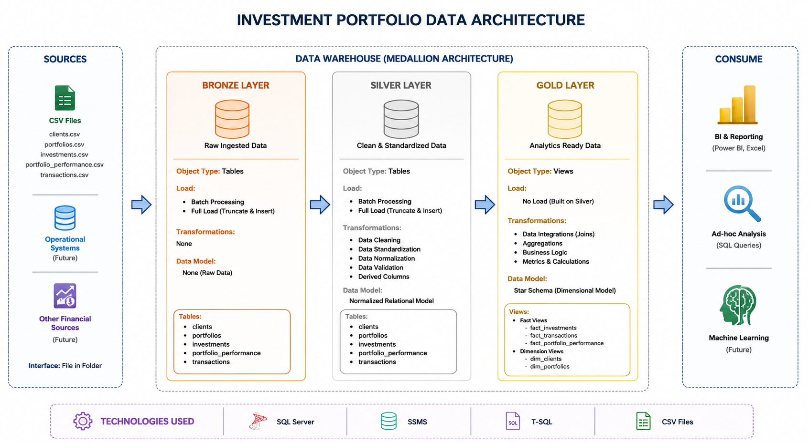
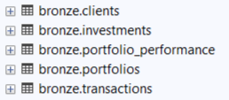
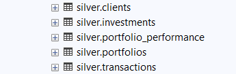
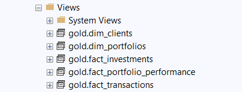

# Investment_portfolio_analysis_sql

This project is built to simulate data handling and analysis for an investment company. It uses **SQL** within **SQL Server Management Studio (SSMS)** to explore and manage datasets related to clients, portfolios, investments, and transactions.

The data is **AI-generated** and designed to reflect realistic financial structures and business logic. It enables practice in areas such as data cleaning, transformation, and performance analysis.

## 📌 Business Objective

The goal of this project is to simulate how an investment company could structure and transform raw financial data into reliable, analysis-ready datasets for reporting, portfolio monitoring, and decision-making.

## 🏗️ Architecture Overview

The project follows the **Medallion Architecture** (Bronze, Silver, and Gold layers) to structure the data workflow:

- **Bronze** for raw ingested data  
- **Silver** for cleaned and joined datasets  
- **Gold** for final analysis-ready views

---

## 🔰 Bronze Layer

The Bronze layer stores raw ingested data loaded directly from CSV files into SQL Server tables with minimal transformation.

Tables

  
Key Processes

- Bulk data ingestion from CSV files
- Initial raw data storage
- Batch loading using stored procedures
- Foundation layer for downstream transformations
  
All DDL scripts and the load procedure are included and documented in the [Bronze Scripts](scripts/bronze) folder.

## ⚙️ Silver Layer 

The Silver layer cleans, standardizes, validates, and transforms raw Bronze data into structured datasets ready for analytical modeling.

### Tables

### Key Transformations

- Data cleaning and standardization
- Validation of inconsistent and invalid records
- Derived columns such as `age_group`
- Standardized transaction categories
- Referential integrity through primary and foreign keys
- Structured transformation using stored procedures
  
All scripts are available in the [Silver Scripts](scripts/silver) folder.

---

## ✨ Gold Layer

The Gold layer provides analytics-ready views structured for reporting, business analysis, and downstream consumption.

### Views

### Analytical Features

- Star schema dimensional modeling
- Fact and dimension views
- Business metrics and aggregations
- Portfolio performance analysis
- Benchmark comparison metrics
- Query-ready analytical datasets

### Fact Views

- fact_investments
- fact_transactions
- fact_portfolio_performance

### Dimension Views

- dim_clients
- dim_portfolios

All scripts are available in the [Gold Scripts](scripts/gold) folder.

---

## 🛠️ Key Skills Demonstrated

- SQL Development
- Data Warehousing
- ETL Pipeline Design
- Medallion Architecture
- Data Cleaning & Validation
- Star Schema Modeling
- Analytical Query Design
- Financial Performance Analysis
- Stored Procedures
- Data Transformation

